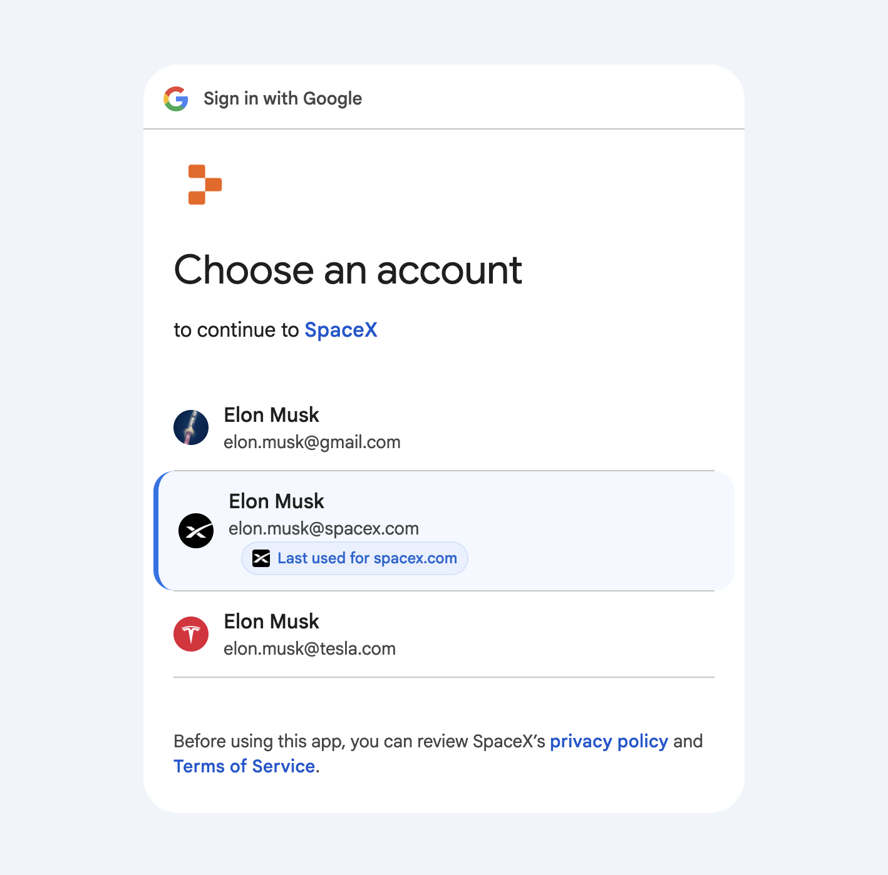

<div align="center">

# AuthMemory: Which Account?

**A Chrome/Firefox extension that remembers which Google Account you used for specific services and highlights it during login.**

[](LICENSE)



[GitHub](https://github.com/AshesOfPhoenix/auth-memory) • [Report Bug](https://github.com/ashesofphoenix/auth-memory/issues)

</div>

A Chrome/Firefox extension that remembers which Google Account you used for specific services and highlights it during login.

## What It Does

When signing into third-party services through Google OAuth, AuthMemory:

- Detects which service you're logging into
- Remembers which Google account you used
- Highlights that account next time with a visual badge

No more guessing which account you used for Replit, Vercel, or any other service!

## Installation

### Chrome

1. Download the latest `auth-memory-chrome-v*.zip` from releases
2. Extract the zip file
3. Open `chrome://extensions`
4. Enable "Developer mode"
5. Click "Load unpacked" and select the extracted folder

### Firefox

1. Download the latest `auth-memory-firefox-v*.zip` from releases
2. Open `about:debugging#/runtime/this-firefox`
3. Click "Load Temporary Add-on"
4. Select the zip file

## Development

```bash
# Install dependencies
npm install

# Build browser packages
npm run build

# Create a release (bump version, build, tag, and push)
npm run release
```

## How It Works

The extension runs on `accounts.google.com` and:

1. Extracts the destination service from OAuth URL parameters
2. Stores a mapping of `domain → email` when you select an account
3. Highlights the previously used account for that domain on future visits

## License

MIT
